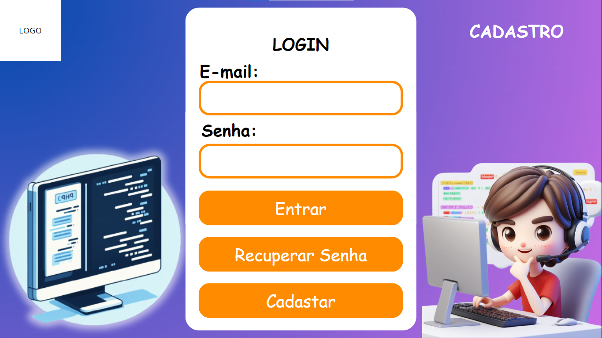
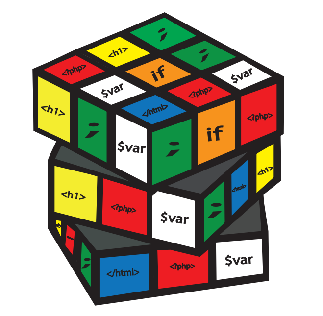

<h1 align="center">PROJETO HACKATHON</h1>

<ul>
  <li>Andrey José Nogueira</li>
  <li>Lucas da Silva Vargas</li>
  <li>Stephanie dos Santos Sparremberger</li>
</ul>

<h1 align="center">Descrição</h1>

O projeto consiste em um site para o <a href="">Corujão.v3</a> (08/12/2023), o qual será um evento unindo 
a competição entre times, jogos e programação. \nEle será um sistema para que seja possivel o administrador inserir desafios
e/ou atividades evolvendo programação em linguagem como PHP, C++, Python, Java etc.

<h1 align="center">Telas</h1>
<h3> Nosso projeto consiste nas seguintes telas: </h3>

<table>
    <tr>
      <th>Tela</th>
      <th>Descrição</th>
    </tr>
    <tr>
      <td>Cadastro</td>
      <td>Página onde os usaários criam suas contas para acessar o Home</td>
    </tr>
  <tr>
      <td>Desafios</td>
      <td>Página "principal", é onde são apresentados os desafios e tela onde o usuário programa</td>
    </tr>
  <tr>
      <td>Equipe</td>
      <td>Tela onde é escolhido o time, a equipe a qual o administrador criou</td>
    </tr>
  <tr>
      <td>Perfil</td>
      <td>Onde são exibidos os dados do usuários</td>
    </tr>
  <tr>
      <td>Alterar Perfil</td>
      <td>Tela onde é possivel mudar suas credenciais. É acessado pela tela Perfil</td>
    </tr>
</table>

<h1 align="center">Tecnologias</h1>

Nosso site utiliza tecnologias como:

  <ul>
  <li>Api de compilação;</li>
  <li>Sistema de Login e Cadastro;</li>
  <li>Atualização do placar em tempo real;</li>
  <li>Armazenamento em Banco de Dados na Núvem.</li>
</ul>

<h1 align="center">Banco de Dados</h1>

  

<h1 align="center">Telas:</h1>

